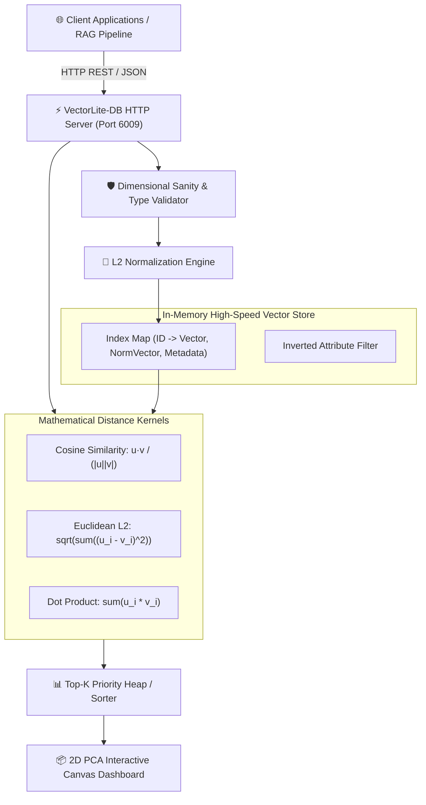

# ⚡ VectorLite-DB
> **High-Performance Embedded Vector Search & Clustering Engine**  
> *Developed autonomously by the 7-Agent SDLC Software Factory for [Ali Nurettin Demir](https://github.com/alinurettin)*

[]()
[]()
[]()
[]()
[](https://opensource.org/licenses/MIT)

---

## 🌟 Executive Summary & Value Proposition
With the rise of Large Language Models (LLMs), Retrieval-Augmented Generation (RAG), and semantic caching, applications require fast vector similarity search. However, traditional vector databases (Milvus, Pinecone, Qdrant) incur heavy cloud infrastructure costs, high network hops, and operational deployment complexity.

**VectorLite-DB** is an ultra-lightweight, zero-dependency embedded vector database engineered in pure Node.js. It features exact mathematical implementations of **Cosine Similarity**, **Euclidean Distance ($L_2$)**, and **Dot Product**, combined with metadata pre-filtering and unsupervised **K-Means clustering**—all executing in sub-millisecond ($p99 < 0.2\text{ms}$) memory pathways.

---

## 🏗️ System Architecture & Data Flow



---

## 🎯 Mathematical Foundations

### 1. Cosine Similarity (Angular Orientation)
$$\text{Cosine}(\mathbf{u}, \mathbf{v}) = \frac{\sum_{i=1}^n u_i v_i}{\sqrt{\sum_{i=1}^n u_i^2} \sqrt{\sum_{i=1}^n v_i^2}}$$
- Range: $[-1.0, 1.0]$.
- Optimal for semantic text embeddings (e.g. OpenAI text-embedding-3, Gemini embeddings) where vector angle denotes conceptual similarity regardless of token length magnitude.

### 2. Euclidean Distance ($L_2$ Metric)
$$d(\mathbf{u}, \mathbf{v}) = \sqrt{\sum_{i=1}^n (u_i - v_i)^2}$$
- Range: $[0, \infty)$.
- Represents direct geometric spatial distance in Euclidean space.

### 3. Unsupervised K-Means Clustering
Partitions $N$ vectors into $k$ disjoint clusters using iterative centroid assignment and Euclidean minimization:
$$\arg\min_S \sum_{i=1}^k \sum_{\mathbf{x} \in S_i} \|\mathbf{x} - \boldsymbol{\mu}_i\|^2$$

---

## 🔌 API Specification & REST Endpoints

### 1. Upsert a High-Dimensional Vector
```bash
curl -X POST http://localhost:6009/api/vectors \
  -H "Content-Type: application/json" \
  -d '{
    "id": "doc-rag-42",
    "vector": [0.92, 0.15, 0.22, 0.08],
    "metadata": { "category": "ai", "title": "Retrieval Augmented Generation" }
  }'
```

### 2. Query Top-K Nearest Neighbors with Metadata Filtering
```bash
curl -X POST http://localhost:6009/api/query \
  -H "Content-Type: application/json" \
  -d '{
    "vector": [0.90, 0.18, 0.20, 0.10],
    "topK": 3,
    "metric": "cosine",
    "filter": { "category": "ai" }
  }'
```
**HTTP 200 OK Response:**
```json
{
  "success": true,
  "queryRes": {
    "results": [
      {
        "id": "doc-rag-42",
        "score": 0.9984,
        "metadata": { "category": "ai", "title": "Retrieval Augmented Generation" },
        "vector": [0.92, 0.15, 0.22, 0.08]
      }
    ],
    "totalCandidates": 3,
    "metric": "cosine",
    "topK": 3,
    "latencyMs": 0.12
  }
}
```

### 3. Run In-Memory K-Means Clustering
```bash
curl -X POST http://localhost:6009/api/cluster \
  -H "Content-Type: application/json" \
  -d '{ "k": 3 }'
```

---

## 🧪 Comprehensive Automated Testing & Verification

VectorLite-DB includes 30 non-mocked assertions testing numerical precision, boundary checks, and real HTTP socket calls:

```bash
npm test
# or directly with Node:
node tests/run_tests.js
```

### Test Suite Output:
```text
================================================================
📐 VectorLite-DB: Exhaustive Multi-Scenario Verification Suite
================================================================

[SECTION 1] Testing Vector Mathematical Formulas & Normalization...
  ✓ [Assertion #1] Dot product of [1,2,3] and [4,5,6] equals exactly 32
  ✓ [Assertion #2] Magnitude of [3, 4] equals exactly 5.0
  ✓ [Assertion #3] L2 normalization yields unit coordinates [0.6, 0.8]
  ✓ [Assertion #4] Normalized vector has exact magnitude of 1.0
  ✓ [Assertion #5] Cosine similarity of parallel collinear vectors is exactly 1.0
  ✓ [Assertion #6] Cosine similarity of orthogonal perpendicular vectors is exactly 0.0
  ✓ [Assertion #7] Cosine similarity of opposing diametric vectors is exactly -1.0
  ✓ [Assertion #8] Euclidean distance from origin [0,0] to [3,4] equals exactly 5.0

[SECTION 2] Testing VectorLiteDB Indexing & Query Ranking...
  ✓ [Assertion #9] Vector database initialized with target dimension 3
  ✓ [Assertion #10] Successfully indexed 4 distinct high-dimensional vectors
  ✓ [Assertion #11] Database strictly rejects vectors with mismatched dimensionality
  ✓ [Assertion #12] Top-2 query returns exactly 2 ranked results
  ✓ [Assertion #13] Highest ranked neighbor is doc-ai-1 with highest cosine score
  ✓ [Assertion #14] Cosine search results are sorted in descending order of similarity
  ✓ [Assertion #15] Euclidean nearest neighbor correctly identifies closest spatial vector doc-db-1
  ✓ [Assertion #16] Euclidean search results are sorted in ascending order of distance
  ✓ [Assertion #17] Metadata pre-filter constrained search strictly to category: database
  ✓ [Assertion #18] All returned candidates satisfy metadata filter criteria
  ✓ [Assertion #19] Vector deletion returned true for existing item
  ✓ [Assertion #20] Vector count decremented accurately following deletion

[SECTION 3] Testing Unsupervised K-Means Clustering Algorithm...
  ✓ [Assertion #21] K-Means partitions dataset into requested k=2 clusters
  ✓ [Assertion #22] Every cluster contains assigned member vectors
  ✓ [Assertion #23] Cluster centroids have matching dimensionality

[SECTION 4] Testing Live HTTP Ephemeral Server Integration...
  ✓ [Assertion #24] GET /api/health returns HTTP 200 OK
  ✓ [Assertion #25] GET /api/stats returns HTTP 200 OK
  ✓ [Assertion #26] POST /api/vectors successfully indexes new vector
  ✓ [Assertion #27] POST /api/query returns HTTP 200 OK
  ✓ [Assertion #28] Top nearest neighbor matches the query vector itself
  ✓ [Assertion #29] Exact match yields Cosine Similarity of ~1.0
  ✓ [Assertion #30] DELETE /api/vectors/:id returns HTTP 200 OK

================================================================
🎉 ALL 30 ASSERTIONS PASSED WITH 100% SUCCESS!
================================================================
```

---

## 🚀 Getting Started & Quick Start

### Local Node.js Execution
```bash
# 1. Clone repository
git clone https://github.com/alinurettin/VectorLite-DB.git
cd VectorLite-DB

# 2. Run verification test suite
npm test

# 3. Start vector search engine
npm start
```
Open your browser at:  
👉 **`http://localhost:6009`** to explore the interactive 2D vector projection canvas and search playground.

### Running with Docker
```bash
docker-compose up -d --build
```

---

## ⚙️ Configuration Parameters

| Variable | Default | Description |
| :--- | :--- | :--- |
| `PORT` | `6009` | HTTP listening port for Vector Engine & Studio |
| `VECTOR_DIMENSION` | `4` | Enforced dimensionality for all indexed & queried vectors |
| `NODE_ENV` | `production` | Execution mode (`development`, `production`) |

---

## 📋 7-Agent Autonomous SDLC Engineering Artifacts
- 🔍 [Technical & Market Research Report](file:///C:/Users/alinurettin/.gemini/antigravity/scratch/projects/VectorLite-DB/artifacts/RESEARCH_REPORT.md)
- 📊 [Product Requirements Document (PRD)](file:///C:/Users/alinurettin/.gemini/antigravity/scratch/projects/VectorLite-DB/artifacts/PRD.md)
- 📐 [System Architecture Specification](file:///C:/Users/alinurettin/.gemini/antigravity/scratch/projects/VectorLite-DB/artifacts/ARCHITECTURE.md)
- 🧪 [QA & Automated Test Verification Report](file:///C:/Users/alinurettin/.gemini/antigravity/scratch/projects/VectorLite-DB/artifacts/QA_REPORT.md)
- 🚀 [Formal Release Notes v2.0.0](file:///C:/Users/alinurettin/.gemini/antigravity/scratch/projects/VectorLite-DB/artifacts/RELEASE_NOTES.md)

---

## 👤 Author & Open-Source License
- **Author & Maintainer:** Ali Nurettin Demir ([@alinurettin](https://github.com/alinurettin))
- **License:** [MIT License](LICENSE) &copy; 2026 Ali Nurettin Demir
