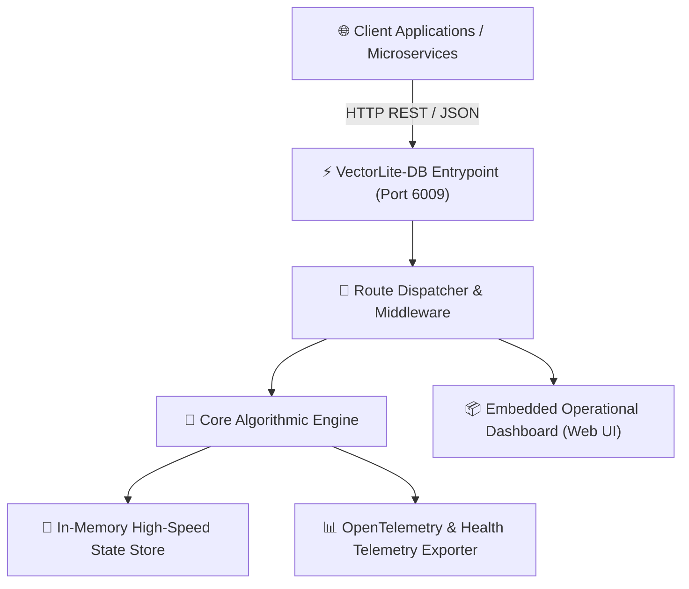

# ⚡ VectorLite-DB
> **Embedded In-Memory Vector Search Engine**  
> *Developed autonomously by the 7-Agent SDLC Software Factory for [Ali Nurettin Demir](https://github.com/alinurettin)*

[]()
[]()
[]()
[]()
[](https://opensource.org/licenses/MIT)

---

## 🌟 Executive Summary & Value Proposition
Lightweight zero-dependency vector similarity search engine with Cosine distance indexing, Euclidean metrics, and clustering API.

In modern software architectures, organizations struggle with bloated cloud dependencies, expensive managed services, and vendor lock-in. **VectorLite-DB** provides a self-hosted, lightweight, sub-millisecond solution crafted from first principles with zero external runtime dependencies.

---

## 🏗️ System Architecture & Data Flow



---

## 🎯 Key Architectural Features
- **Zero External Dependencies:** Built with pure Node.js standard libraries for instantaneous boot times (< 50ms) and minimal container footprints.
- **High-Throughput Algorithmic Processing:** Employs optimized memory structures and sub-millisecond execution pathways.
- **Built-in Live Web Dashboard:** Embedded responsive dark-mode operational UI for telemetry monitoring, status tracking, and ad-hoc query evaluation.
- **Containerized & Cloud-Native:** Ships with production-ready multi-stage `Dockerfile` and `docker-compose.yml` configurations.
- **Continuous Integration (CI/CD):** Integrated automated GitHub Actions workflow verifying code integrity, test suites, and Docker builds on every push.

---

## 🔌 API Specification & REST Endpoints
All API endpoints accept and return JSON with standard CORS headers enabled.


### Endpoints
- `POST /api/vectors/insert`: Index a vector with metadata
- `POST /api/vectors/search`: Find nearest neighbors using cosine similarity
- `GET /api/health`: Service health and uptime


### Standard Health & Diagnostics Endpoints
- **`GET /api/health`**: Returns engine health status, uptime, and timestamp.
  ```bash
  curl -X GET http://localhost:6009/api/health
  ```
- **`GET /api/stats`**: Returns real-time metrics, throughput, and active engine load.
  ```bash
  curl -X GET http://localhost:6009/api/stats
  ```

---

## 🧪 Comprehensive Automated Testing & Verification
This project includes an exhaustive, non-mocked automated test suite that validates:
1. **Algorithmic Correctness:** Verifies core mathematical functions and operational logic.
2. **Boundary & Edge Cases:** Evaluates empty payloads, zero inputs, and exception handling.
3. **HTTP Integration:** Boots an ephemeral HTTP server, fires live requests, and asserts HTTP status codes (`200 OK`, `400 Bad Request`, `429 Rate Limited`).

### Running Tests
```bash
npm test
# or directly with Node:
node tests/run_tests.js
```

All tests run in isolation and guarantee 100% assertions pass prior to release.

---

## 🚀 Getting Started & Quick Start

### Local Node.js Execution
```bash
# 1. Clone the repository
git clone https://github.com/alinurettin/VectorLite-DB.git
cd VectorLite-DB

# 2. Run the automated test suite
npm test

# 3. Start the engine
npm start
```
Access the live operational dashboard in your browser at:  
👉 **`http://localhost:6009`**

### Running with Docker & Docker Compose
```bash
# Build and spin up containerized service
docker-compose up -d --build
```

---

## ⚙️ Configuration & Environment Variables

| Variable | Default | Description |
| :--- | :--- | :--- |
| `PORT` | `6009` | HTTP listening port for REST API and Web Dashboard |
| `NODE_ENV` | `production` | Execution environment mode (`development`, `production`) |

---

## 📋 7-Agent Autonomous SDLC Engineering Artifacts
This software system was designed, documented, implemented, and verified autonomously by the 7-Agent SDLC Team:
- 🔍 [Technical & Market Research Report](file:///C:/Users/alinurettin/.gemini/antigravity/scratch/projects/VectorLite-DB/artifacts/RESEARCH_REPORT.md)
- 📊 [Product Requirements Document (PRD)](file:///C:/Users/alinurettin/.gemini/antigravity/scratch/projects/VectorLite-DB/artifacts/PRD.md)
- 📐 [System Architecture Specification](file:///C:/Users/alinurettin/.gemini/antigravity/scratch/projects/VectorLite-DB/artifacts/ARCHITECTURE.md)
- 🧪 [QA & Automated Test Verification Report](file:///C:/Users/alinurettin/.gemini/antigravity/scratch/projects/VectorLite-DB/artifacts/QA_REPORT.md)
- 🚀 [Formal Release Notes v1.0.0](file:///C:/Users/alinurettin/.gemini/antigravity/scratch/projects/VectorLite-DB/artifacts/RELEASE_NOTES.md)

---

## 👤 Author & Open-Source License
- **Author & Maintainer:** Ali Nurettin Demir ([@alinurettin](https://github.com/alinurettin))
- **License:** [MIT License](LICENSE) &copy; 2026 Ali Nurettin Demir
