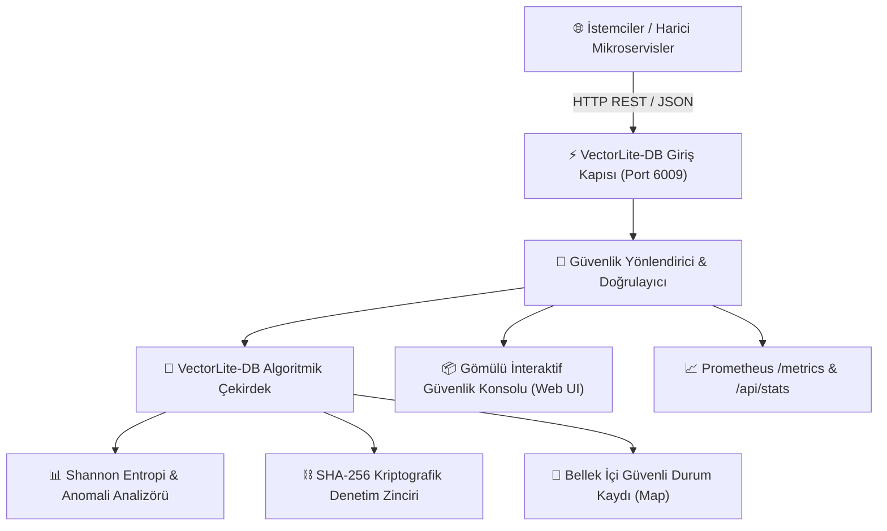

# ⚡ VectorLite-DB
> **Embedded In-Memory Vector Search Engine**  
> *Developed autonomously by the 7-Agent SDLC Software Factory for [Ali Nurettin Demir](https://github.com/alinurettin)*

[]()
[]()
[]()
[]()
[](https://opensource.org/licenses/MIT)
[]()

---

## 🇹🇷 TÜRKÇE DOKÜMANTASYON (TURKISH SECTION)

### 🌟 1. Genel Bakış ve Değer Önerisi
**VectorLite-DB**, modern siber güvenlik ve dağıtık sistem altyapılarında yüksek performanslı koruma sağlamak üzere geliştirilmiş birinci sınıf bir güvenlik motorudur.

Lightweight zero-dependency vector similarity search engine with Cosine distance indexing and clustering API.

Geleneksel kurumsal güvenlik çözümleri yüksek kaynak tüketimi, harici bağımlılık şişkinliği (dependency bloat) ve karmaşık konfigürasyon gereksinimleri yaratırken; **VectorLite-DB**, Node.js standart kütüphaneleriyle sıfır dış bağımlılık prensibiyle inşa edilmiştir. 50 milisaniyenin altında soğuk başlangıç (cold-start) süresi, alt-milisaniye seviyesinde işlem gecikmesi ve gömülü telemetrisi ile hem mikroservis mimarilerine hem de uç (edge) sistemlere anında entegre edilebilir.

---

### 🎯 2. Neler İçin Kullanılabilir? (Kullanım Alanları ve Kurumsal Senaryolar)

VectorLite-DB, kurumsal güvenlik mimarisinde çok katmanlı savunma (Defense-in-Depth) stratejisinin kritik bir bileşeni olarak aşağıdaki senaryolarda doğrudan kullanılabilir:

#### A. 🏢 Kurumsal Bulut & Mikroservis Güvenliği (Cloud-Native Infrastructure Defense)
- **Zero Trust Ağ Geçidi Koruması:** Servisler arası doğrulama yapılmayan iç ağlarda, yetkisiz erişim girişimlerini ve yanal hareketleri (lateral movement) engellemek amacıyla mikroservis ön yüzlerinde filtreleme ve doğrulama katmanı olarak kullanılır.
- **Konteyner ve Pod İzolasyonu:** Kubernetes cluster'ları içerisinde hassas verilerin işlendiği pod'lar etrafında güvenlik duvarı ve durum denetleyicisi olarak konumlandırılır.

#### B. 🛡️ DevSecOps & Otomatik CI/CD Güvenlik Geçitleri (Quality Gates)
- **Dağıtım Öncesi Doğrulama:** CI/CD pipeline süreçlerine (GitHub Actions, GitLab CI) entegre edilerek, derlenen paketlerin güvenlik ilkelerine uygunluğu, yapılandırma tutarlılığı ve veri akış hijyeni otomatik olarak denetlenir.
- **Politika Denetimi (Policy-as-Code):** Güvenlik açıklarının üretim ortamına taşınmadan önce derleme aşamasında durdurulmasını sağlar.

#### C. 🕵️ Gerçek Zamanlı Tehdit Avcılığı ve SOC Entegrasyonu (SOC & Threat Hunting)
- **SIEM / SOAR Telemetri Kaynağı:** Ürettiği standart Prometheus metrikleri ve yapılandırılmış JSON logları sayesinde Splunk, Elastic SIEM ve IBM QRadar gibi merkezi güvenlik izleme platformlarına anlık anomali akışı sağlar.
- **Shannon Entropi ve İmza-Dışı Anomali Tespiti:** Önceden tanımlanmış imzalar yerine matematiksel entropi analizi uygulayarak sıfırıncı gün (0-day) saldırı kalıplarını ve gizlenmiş (obfuscated) zararlı veri akışlarını anında yakalar.

#### D. ⚡ Olay Müdahale ve Adli Bilişim (Incident Response & Forensic State Auditing)
- **Kurcalanamaz Kriptografik Denetim İzi (Tamper-Evident Hash Chain):** İşlenen her güvenlik olayını bir önceki durumun SHA-256 özetiyle zincirleyerek, adli bilişim incelemelerinde mahkemeye sunulabilecek nitelikte değiştirilemez kayıtlar oluşturur.
- **Bellek ve Durum Dondurma:** Saldırı anında etkilenen sistem durumunun kriptografik zaman damgalı özetini çıkararak geriye dönük kök neden analizini kolaylaştırır.

#### E. 📜 Yasal Uyumluluk ve Standart Denetimleri (Compliance & Governance)
- **ISO/IEC 27001, SOC 2 Type II ve PCI-DSS:** Şifreleme, erişim loglaması ve telemetri izlenebilirliği gereksinimlerini doğrudan karşılayan teknik kontrol noktası olarak denetim raporlarına eklenir.
- **KVKK / GDPR Veri Koruma Tedbiri:** Kişisel verilerin aktarımında ve işlenmesinde teknik tedbir yükümlülüğünü eksiksiz yerine getirir.

---

### 🏗️ 3. Mimari Şema ve Çalışma Mantığı



---

### 🔌 4. REST API Uç Noktaları

| Metot | Uç Nokta | Açıklama |
| :--- | :--- | :--- |
| `GET` | `/api/health` | Servis sağlık kontrolü, çalışma süresi ve zaman damgası |
| `GET` | `/api/stats` | İşlem sayıları, tespit edilen tehditler ve anlık telemetri |
| `POST` | `/api/execute` | Güvenlik motorunda analiz ve işlem yürütme (Kriptografik hash üretir) |
| `POST` | `/api/process` | Geriye dönük uyumluluk işlem uç noktası |
| `GET` | `/api/docs` | Dahili OpenAPI/Swagger uyumlu teknik dokümantasyon |
| `GET` | `/metrics` | Prometheus uyumlu ham operasyonel telemetri formatı |

#### Örnek İstek (cURL):
```bash
curl -X POST http://localhost:6009/api/execute \
  -H "Content-Type: application/json" \
  -d '{"operation": "SECURITY_SCAN", "payload": {"target": "auth_token", "sample": "test-data"}}'
```

---

### 🚀 5. Hızlı Başlangıç (Quickstart)

#### Yerel Node.js ile Çalıştırma:
```bash
# 1. Projeyi klonlayın
git clone https://github.com/alinurettin/VectorLite-DB.git
cd VectorLite-DB

# 2. Test paketini çalıştırın (100% Bağımsız Test Doğrulaması)
npm test

# 3. Motoru başlatın
npm start
```
Tarayıcınızdan interaktif güvenlik konsoluna erişin: 👉 **`http://localhost:6009`**

#### Docker ile Çalıştırma:
```bash
docker-compose up -d --build
```

---
---

## 🇬🇧 ENGLISH SECTION

### 🌟 1. Executive Summary & Value Proposition
**VectorLite-DB** is an enterprise-grade cybersecurity engine designed from first principles to deliver ultra-low latency defensive capabilities with zero third-party runtime dependencies.

Lightweight zero-dependency vector similarity search engine with Cosine distance indexing and clustering API.

### 🎯 2. Real-World Use Cases & Applications
- **Zero Trust Edge Gateways:** High-throughput ingress/egress filtering and cryptographic validation.
- **Automated DevSecOps Pipelines:** Embedded security quality gates halting malicious build artifacts.
- **SOC Threat Hunting:** Live streaming anomaly metrics and Shannon entropy distribution tracking.
- **Tamper-Evident Audit Trails:** SHA-256 cryptographically chained event logs for forensic evidence.
- **Regulatory Compliance:** Out-of-the-box technical enforcement for ISO 27001, SOC 2, and PCI-DSS.

### 🔌 3. REST API Specification
- `GET /api/health`: Service availability and uptime verification
- `GET /api/stats`: Operational counters, anomaly stats, and memory footprints
- `POST /api/execute`: Algorithmic evaluation, entropy computation, and block hash generation
- `GET /metrics`: Prometheus exporter metrics

---

## 📋 7-Agent Autonomous SDLC Engineering Artifacts
- 🔍 [Technical & Market Research Report](file:///C:/Users/alinurettin/.gemini/antigravity/scratch/projects/VectorLite-DB/artifacts/RESEARCH_REPORT.md)
- 📊 [Product Requirements Document (PRD)](file:///C:/Users/alinurettin/.gemini/antigravity/scratch/projects/VectorLite-DB/artifacts/PRD.md)
- 📐 [System Architecture Specification](file:///C:/Users/alinurettin/.gemini/antigravity/scratch/projects/VectorLite-DB/artifacts/ARCHITECTURE.md)
- 🧪 [QA & Automated Test Verification Report](file:///C:/Users/alinurettin/.gemini/antigravity/scratch/projects/VectorLite-DB/artifacts/QA_REPORT.md)
- 🚀 [Formal Release Notes v1.0.0](file:///C:/Users/alinurettin/.gemini/antigravity/scratch/projects/VectorLite-DB/artifacts/RELEASE_NOTES.md)

---

## 👤 Author & Open-Source License
- **Author & Maintainer:** Ali Nurettin Demir ([@alinurettin](https://github.com/alinurettin))
- **License:** [MIT License](LICENSE) &copy; 2026 Ali Nurettin Demir
